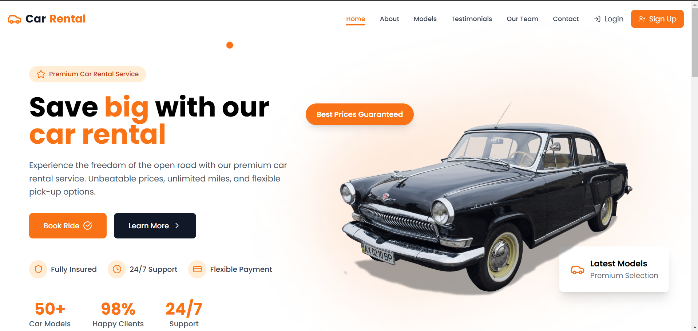
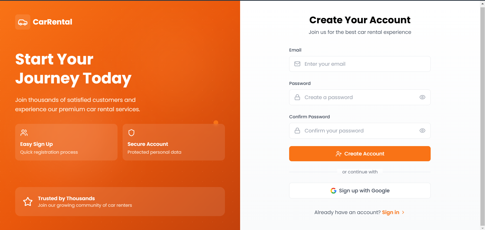

# Car Rental 

Welcome to the Car Rental  project! This application allows users to rent cars easily and efficiently. It provides a user-friendly interface for both customers and administrators to manage car rentals.

## This project is now OFFICIALLY accepted for

- 

## Table of Contents

- [Features](#features)
- [Preview](#preview)
- [Technologies Used](#technologies-used)
- [Installation](#installation)
- [Usage](#usage)

## Features

- User registration and authentication
- Browse available cars for rent
- Book a car for a specified duration
- View booking history
- Admin panel for managing cars and bookings
- Search and filter options for cars
- Responsive design for mobile and desktop

## Preview
 - 
 - 
 - 

## Technologies Used

- **Frontend:** HTML, CSS, JavaScript, React 
- **Backend:** Node.js, Express.js 
- **Database:** MongoDB 
- **Deployment:** Vercel

## Installation

### Clone the Repository
1. Clone the repository to your local machine:
   ```sh
   git clone https://github.com/saurabh-dev-vns/car-rental.git
   ```
2. Navigate to the project directory:
   ```sh
   cd car-rental
   ```

### Client
1. Navigate to the client directory:
   ```sh
   cd client
   ```
2. Install dependencies:
   ```sh
   npm install
   ```
3. Create a `.env` file in the client directory and add the necessary configurations. For example:
   ```plaintext
   VITE_API_URL=http://localhost:5000/api
   VITE_API_KEY="your_api_key_here"
   VITE_PROJECT_ID="your_project_id_here"
   VITE_AUTH_DOMAIN="your_auth_domain_here"
   VITE_STORAGE_BUCKET="your_storage_bucket_here"
   VITE_MESSAGING_SENDER_ID="your_messaging_sender_id_here"
   VITE_APP_ID="your_app_id_here"
   VITE_MEASUREMENT_ID="your_measurement_id_here"
   ```
4. Start the development server:
   ```sh
   npm run dev
   ```

### Server
1. Navigate to the server directory:
   ```sh
   cd server
   ```
2. Install dependencies:
   ```sh
   npm install
   ```
3. Create a `.env` file in the server directory and add the necessary configurations. For example:
   ```plaintext
   PORT=5000
   MONGO_URI=mongodb://localhost:27017/car-rental
   JWT_SECRET=your_jwt_secret
   ```
4. Start the server:
   ```sh
   npm start
   ```

## Usage
1. User Registration: Create an account to start renting cars.
2. Browse Cars: View the list of available cars and their details.
3. Book a Car: Select a car, choose your rental dates, and confirm your booking.
4. Admin Panel: If you are an admin, log in to manage cars and bookings.

## License

This project is licensed under the MIT License. See the [LICENSE](LICENSE) file for details.
